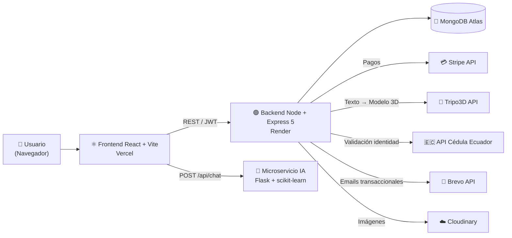

<div align="center">

# 🏗️ POLI-RENT

### Sistema Web de Gestión de Préstamos y Alquiler de Recursos Académicos y Tecnológicos

**Escuela de Formación de Tecnólogos (ESFOT) — Escuela Politécnica Nacional**

[](https://nodejs.org/)
[](https://expressjs.com/)
[](https://www.mongodb.com/)
[](https://react.dev/)
[](https://vitejs.dev/)
[](https://tailwindcss.com/)
[](https://flask.palletsprojects.com/)
[](https://stripe.com/)

🌐 **[Aplicación en vivo](https://proyecto-alquiler-five.vercel.app)** · 📚 **[Documentación de la API (Swagger)](https://poli-rent-backend.onrender.com/api-docs/)** · ⚙️ **API Backend ([https://poli-rent-backend.onrender.com/api](https://poli-rent-backend.onrender.com/)**

</div>

---

## 📌 Descripción

**POLI-RENT** automatiza la administración, registro y seguimiento de préstamos/alquiler de materiales tecnológicos de la ESFOT: los estudiantes exploran el catálogo, reservan recursos, pagan en línea y reciben asistencia de un chatbot con IA; los administradores gestionan inventario, usuarios, reservas y entregas desde un dashboard.

Proyecto desarrollado como **Trabajo de Integración Curricular** (ESFOT — EPN).

##  Equipo de Desarrollo

| Integrante | Rol |
|---|---|
| Diego Camacho | Desarrollo Backend  |
| Jairo Maigua |  Desarrollo Frontend |
| Anthony Ledesma | Desarrollo Movil / Scrum Master |

---

## 🏛️ Arquitectura

El sistema sigue el patrón **MVC** en el backend principal, complementado con un **microservicio de IA** independiente y servicios externos en la nube:



### Flujo principal del sistema

1. **Registro** → el estudiante se registra (con validación de cédula ecuatoriana) y confirma su cuenta vía email (Brevo).
2. **Autenticación** → login con JWT; los roles (`Usuario` / `Admin`) se verifican contra la base de datos en cada petición.
3. **Catálogo** → productos con imágenes en Cloudinary y previsualización de modelos 3D generados con IA (Tripo3D + Three.js).
4. **Reserva** → el estudiante solicita un recurso; el administrador la aprueba o rechaza.
5. **Pago** → orden de compra con Stripe *PaymentIntents*; un *cron job* expira automáticamente las órdenes no pagadas.
6. **Entrega** → el administrador marca la orden como entregada.
7. **Asistencia** → el chatbot con IA responde dudas sobre alquileres, pagos y devoluciones en lenguaje natural.

---

##  Las 4 APIs externas integradas

| # | API | Uso en POLI-RENT | Estado |
|---|-----|------------------|--------|
| 1 | 💳 **Stripe** | Pasarela de pagos: órdenes con PaymentIntents, confirmación, cancelación y expiración automática | ✅ Implementada |
| 2 | 🧊 **Tripo3D** | Generación de modelos 3D (`.glb`) de herramientas a partir de un prompt de texto | ✅ Implementada |
| 3 | 🇪🇨 **API Cédula Ecuador** | Validación de identidad: algoritmo oficial ecuatoriano + consulta de datos del titular | ✅ Implementada |
| 4 | 🤖 **Chatbot IA** | Asistente conversacional entrenado con TF-IDF + red neuronal (MLP) sobre intenciones del dominio de alquiler | 🚧 En desarrollo |

<!-- 📸 AQUÍ: capturas de las APIs funcionando (checkout de Stripe, modelo 3D generado, validación de cédula, chatbot) -->

---

##  Módulos y Endpoints

Documentación interactiva completa en **[Swagger](https://poli-rent-backend.onrender.com/api-docs/)**.

<details>
<summary><b>👤 Usuarios y Autenticación</b></summary>

| Método | Endpoint | Acceso |
|--------|----------|--------|
| POST | `/api/registro` | Público |
| GET | `/api/confirm/:token` | Público |
| POST | `/api/usuario/login` | Público |
| POST | `/api/recuperarpassword` | Público |
| GET | `/api/recuperarpassword/:token` | Público |
| POST | `/api/nuevopassword/:token` | Público |
| GET | `/api/usuario/perfil` | 🔒 Usuario |
| PUT | `/api/actualizarperfil` | 🔒 Usuario |
| PUT | `/api/actualizarpassword/:id` | 🔒 Usuario |
| GET | `/api/usuarios` | 🔐 Admin |
| PUT | `/api/usuarios/bloquear/:id` | 🔐 Admin |
| DELETE | `/api/usuarios/:id` | 🔐 Admin |

</details>

<details>
<summary><b>🛠️ Productos (Catálogo e Inventario)</b></summary>

| Método | Endpoint | Acceso |
|--------|----------|--------|
| GET | `/api/productos` | Público |
| GET | `/api/producto/:id` | 🔒 Usuario |
| GET | `/api/productos/admin` | 🔐 Admin |
| POST | `/api/producto/registro` | 🔐 Admin |
| PUT | `/api/producto/actualizar/:id` | 🔐 Admin |
| DELETE | `/api/producto/eliminar/:id` | 🔐 Admin (baja lógica) |

</details>

<details>
<summary><b>📅 Reservas</b></summary>

| Método | Endpoint | Acceso |
|--------|----------|--------|
| POST | `/api/registrarReserva` | 🔒 Usuario |
| GET | `/api/reserva/mis-reservas` | 🔒 Usuario |
| GET | `/api/reservas` | 🔐 Admin |
| PUT | `/api/reservas/aprobar/:id` | 🔐 Admin |
| PUT | `/api/reservas/rechazar/:id` | 🔐 Admin |

</details>

<details>
<summary><b>💳 Órdenes y Pagos (Stripe)</b></summary>

| Método | Endpoint | Acceso |
|--------|----------|--------|
| POST | `/api/ordenes` | 🔒 Usuario |
| POST | `/api/ordenes/confirmar-pago` | 🔒 Usuario |
| GET | `/api/ordenes/mis-ordenes` | 🔒 Usuario |
| PUT | `/api/ordenes/cancelar/:id` | 🔒 Usuario |
| GET | `/api/ordenes` | 🔐 Admin |
| PUT | `/api/ordenes/entregar/:id` | 🔐 Admin |

 Incluye **cron job** que expira órdenes pendientes de pago automáticamente.

</details>

<details>
<summary><b>🧊 Generación 3D · 🇪🇨 Cédula · 🤖 Chatbot</b></summary>

| Método | Endpoint | Servicio | Acceso |
|--------|----------|----------|--------|
| POST | `/api/generate-3d` | Tripo3D (texto → modelo `.glb`) | Público |
| GET | `/api/cedula/:numero` | Validación cédula ecuatoriana | Público |
| POST | `/api/chat` | Chatbot IA (microservicio Flask) | Público 🚧 |
| GET | `/health` | Estado del servidor | Público |

</details>

---

## 🛠️ Stack Tecnológico

<!-- 📸 AQUÍ: imagen/collage con los logos de los frameworks si se desea -->

### Backend (`/backend`)
| Tecnología | Uso |
|---|---|
| **Node.js + Express 5** | Servidor REST (patrón MVC) |
| **MongoDB + Mongoose 9** | Base de datos NoSQL y modelado de datos |
| **JWT + bcryptjs** | Autenticación por token y hash de contraseñas |
| **Stripe SDK** | Pasarela de pagos |
| **Cloudinary + Multer** | Almacenamiento y subida de imágenes |
| **Brevo API** | Envío de correos transaccionales |
| **node-cron** | Expiración automática de órdenes |
| **Swagger (jsdoc + ui)** | Documentación interactiva de la API |

### Microservicio de IA (`/backend-IA`) 
| Tecnología | Uso |
|---|---|
| **Python + Flask** | API del chatbot (`POST /api/chat`) |
| **scikit-learn** | TF-IDF + clasificador de red neuronal (MLP) |
| **Dataset propio** | 17 intenciones del dominio de alquiler (JSON) |
| **Gunicorn** | Servidor WSGI para despliegue |

### Frontend (`/frontend`)
| Tecnología | Uso |
|---|---|
| **React 18 + Vite** | SPA e interfaz de usuario |
| **Tailwind CSS 4** | Estilos |
| **Zustand** | Manejo de estado global |
| **React Router 7** | Enrutamiento y rutas protegidas |
| **React Hook Form** | Formularios y validación |
| **Stripe.js + React Stripe** | Checkout de pagos |
| **Three.js + React Three Fiber** | Visualización de modelos 3D |
| **Axios · Toastify · SweetAlert2 · tsParticles** | HTTP, notificaciones y efectos visuales |

---

## 📂 Estructura del Proyecto

```
proyectoAlquiler/
├── backend/               # API REST principal (Node + Express, MVC)
│   └── src/
│       ├── config/        # Brevo (email), Swagger
│       ├── controllers/   # Lógica: usuarios, productos, reservas, órdenes, cédula
│       ├── middlewares/   # JWT (autenticación) y verificación de rol Admin
│       ├── models/        # Esquemas Mongoose: Usuario, Producto, Reserva, OrdenCompra
│       ├── routers/       # Definición de rutas por módulo
│       ├── database.js    # Conexión a MongoDB
│       └── server.js      # Configuración de Express, CORS y montaje de rutas
├── backend-IA/            # 🚧 Microservicio del chatbot (Flask + scikit-learn)
│   ├── app_ia.py          # Entrenamiento del modelo y endpoint /api/chat
│   └── dataset_entrenamiento.json
├── frontend/              # SPA React + Vite + Tailwind
│   └── src/
│       ├── components/    # Componentes reutilizables
│       ├── context/       # Stores de Zustand (auth, perfil, órdenes)
│       ├── layout/        # Layouts (dashboard, público)
│       ├── pages/         # Vistas
│       └── routers/       # Rutas y protección por rol
└── DEPLOYMENT_GUIDE.md    # Guía de despliegue (Render + Vercel)
```

---

## 🚀 Instalación y Ejecución Local

### Requisitos previos
- Node.js 18+ · Python 3.10+ · Cuenta en MongoDB Atlas

### 1. Clonar el repositorio
```bash
git clone https://github.com/diegod25122/proyectoAlquiler.git
cd proyectoAlquiler
```

### 2. Backend
```bash
cd backend
npm install
# Crear .env con las variables de la tabla de abajo
npm run dev        # → http://localhost:3000
```

**Variables de entorno del backend (`.env`):**

| Variable | Descripción |
|---|---|
| `MONGODB_URI` | Cadena de conexión a MongoDB Atlas |
| `JWT_SECRET` | Llave secreta para firmar los tokens |
| `STRIPE_PRIVATE_KEY` | Clave secreta de Stripe |
| `TRIPO_API_KEY` | API key de Tripo3D |
| `ECUADOR_CEDULA_KEY` | API key del servicio de datos de cédula |
| `BREVO_API_KEY` / `USER_MAILTRAP` | Credenciales para envío de emails |
| `CLOUDINARY_CLOUD_NAME` / `_API_KEY` / `_API_SECRET` | Credenciales de Cloudinary |
| `URL_FRONTEND` | URL del frontend (para links de confirmación) |

### 3. Frontend
```bash
cd frontend
npm install
# Crear .env con: VITE_BACKEND_URL=http://localhost:3000/api
npm run dev        # → http://localhost:5173
```

### 4. Microservicio de IA (chatbot) 
```bash
cd backend-IA
pip install -r requirements.txt
python app_ia.py   # → http://localhost:5000/api/chat
```

---

## ☁️ Despliegue

| Componente | Plataforma | URL |
|---|---|---|
| Backend (API REST) | **Render** | https://poli-rent-backend.onrender.com/api |
| Documentación Swagger | **Render** | https://poli-rent-backend.onrender.com/api-docs |
| Frontend (SPA) | **Vercel** | https://proyecto-alquiler-five.vercel.app |
| Microservicio IA | **Render** (Gunicorn) | 🚧 En despliegue |

Guía paso a paso en [`DEPLOYMENT_GUIDE.md`](./DEPLOYMENT_GUIDE.md).

> ⚠️ El plan gratuito de Render suspende el servicio por inactividad: la **primera petición puede tardar ~50 segundos** mientras el servidor despierta.

---

## 📸 Capturas del Sistema

<!-- 📸 AQUÍ agregar capturas reales, por ejemplo:
| Catálogo | Dashboard Admin |
|---|---|
|  |  |

| Pago con Stripe | Chatbot IA |
|---|---|
|  |  |
-->

*(Próximamente: capturas del catálogo, dashboard administrativo, checkout de Stripe, visor 3D y chatbot.)*

---

## 🎓 Contexto Académico

Proyecto desarrollado como **Trabajo de Integración Curricular** de la carrera de Desarrollo de Software — **Escuela de Formación de Tecnólogos (ESFOT), Escuela Politécnica Nacional**, Quito, Ecuador.
